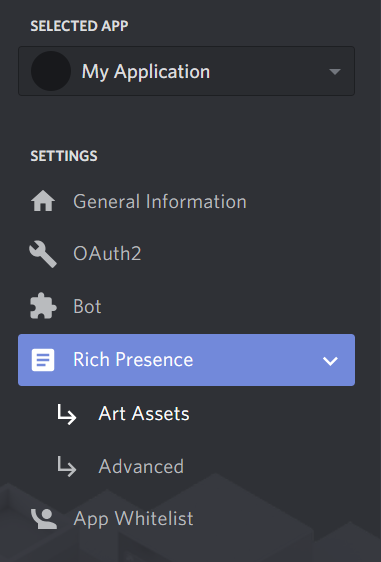

# Discord Rich Presence

## Setup

### Create a Discord application

1. Create a new application by going [here](https://discordapp.com/developers/applications/).
Make sure you pick a good name - this will show up in your rich presence.
2. Once you  have your application created, head to the Art Assets section of the application config.



3. Upload the images you would like to use in your rich presence.  Note the names at the bottom of this page after they're uploaded.  You will need to put these in your config.yaml.
4. Open up the config.yaml in your favorite text editor.

```yaml
client_id: 11122233344455666 # This is the Client ID from the application you created
interval: 30000 # How often to change your rich presence in milliseconds (min. 15000)
statuses: # A list of statuses to rotate between
- state: "Discord Rich Presence" 
  details: "discord_rp"
  assets:
    large_image: "image1"
    large_text: "Proudly written in Rust"
    small_image: "kelwing_pfp"
    small_text: "Developer"
- state: "My second state"
  details: "Details for my second state"
  assets:
    large_image: "image2"
    large_text: "Hey look another image!"
    small_image: "image3"
    small_text: "Dis image is tiny!"
```

The rest of these values correspond with a value in Rich Presence Visualizer on your applications config.  Play with the values there until it looks the way you want it, and transpose those values into the config.

5. Run the discord_rp executable and check Discord!